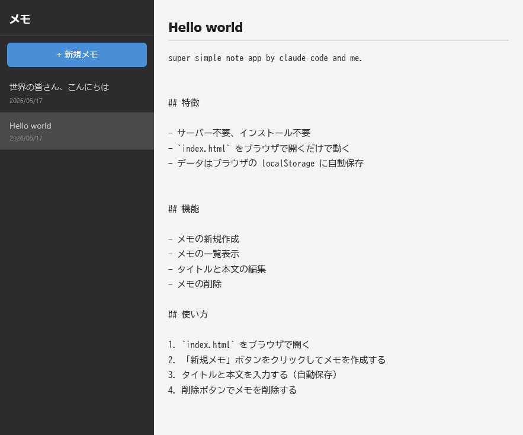

# simple_memo

super simple note app by claude code and me.

ブラウザで動くシンプルなメモアプリ。




## 特徴

- サーバー不要、インストール不要
- `index.html` をブラウザで開くだけで動く
- データはブラウザの localStorage に自動保存


## 機能

- メモの新規作成
- メモの一覧表示
- タイトルと本文の編集
- メモの削除

## 使い方

1. `index.html` をブラウザで開く
2. 「新規メモ」ボタンをクリックしてメモを作成する
3. タイトルと本文を入力する（自動保存）
4. 削除ボタンでメモを削除する

## 技術スタック

- HTML / CSS / JavaScript（バニラJS）
- localStorage

## ファイル構成

```
my_1st_project/
  index.html   # アプリ本体
  test.html    # テスト
  design.md    # 設計書
  procedure.md # 作業手順
  README.md    # 本ファイル
```

